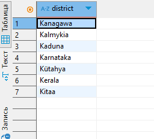
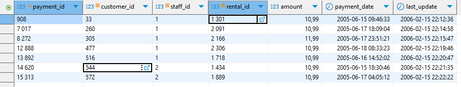
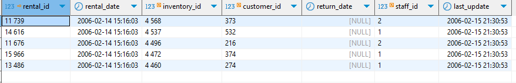
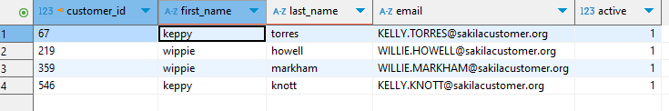

# Домашнее задание «SQL. Часть 1» - Фролов КС

### Задание 1

Получите уникальные названия районов из таблицы с адресами, которые начинаются на “K” и заканчиваются на “a” и не содержат пробелов.

### Ответ: 

```sql
SELECT DISTINCT district
FROM address
WHERE district LIKE 'K%a' 
  AND district NOT LIKE '% %';
```



### Задание 2

Получите из таблицы платежей за прокат фильмов информацию по платежам, которые выполнялись в промежуток с 15 июня 2005 года по 18 июня 2005 года **включительно** и стоимость которых превышает 10.00.

### Ответ: 

```sql
SELECT *
FROM payment
WHERE payment_date BETWEEN '2005-06-15 00:00:00' AND '2005-06-18 23:59:59'
  AND amount > 10.00;
```


### Задание 3

Получите последние пять аренд фильмов.

### Ответ: 

```sql
SELECT *
FROM rental
ORDER BY rental_date DESC
LIMIT 5;
```



### Задание 4

Одним запросом получите активных покупателей, имена которых Kelly или Willie. 

Сформируйте вывод в результат таким образом:
- все буквы в фамилии и имени из верхнего регистра переведите в нижний регистр,
- замените буквы 'll' в именах на 'pp'.

### Ответ: 

```sql
SELECT 
    customer_id,
    REPLACE(LOWER(first_name), 'll', 'pp') AS first_name,
    LOWER(last_name) AS last_name,
    email,
    active
FROM customer
WHERE active = 1
  AND (first_name = 'Kelly' OR first_name = 'Willie');
  ```


